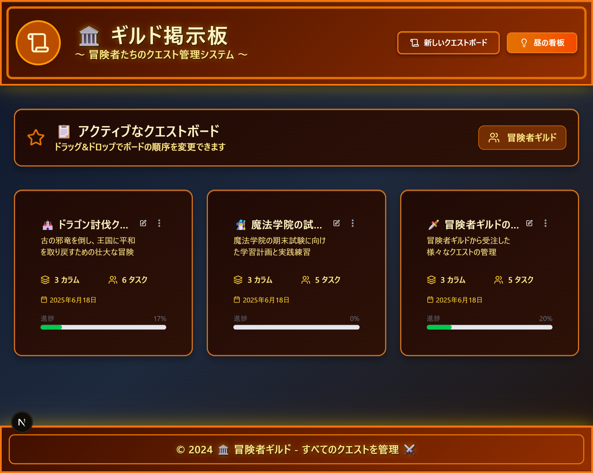
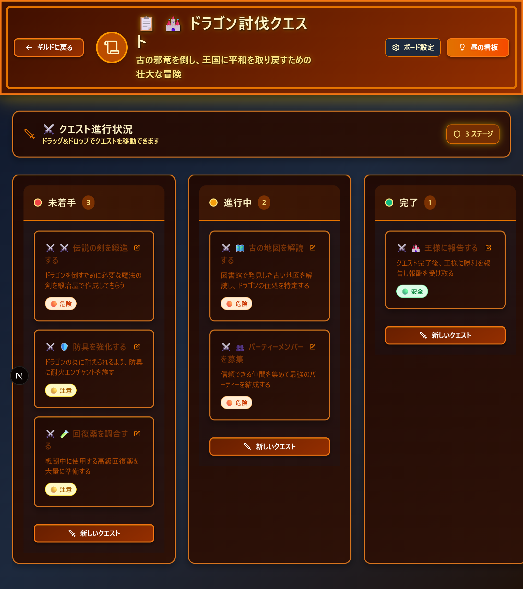

# 🏛️ ギルド掲示板 - ファンタジーカンバンアプリ

> 🤖 **このアプリケーションはAIのRovo Dev CLIで作成されました**  
> バイブコーディング手法を使用して、AIアシスタントと対話しながら開発したファンタジーテーマのカンバンボードアプリケーションです。

冒険者のクエスト管理をイメージした美しいUIで、タスク管理を楽しく行えます。



## ✨ 特徴

- 🏰 **ファンタジーテーマ**: 冒険者ギルドをイメージしたUI/UX
- 📋 **カンバンボード**: ドラッグ&ドロップでタスクを管理
- 🎨 **美しいデザイン**: レトロゲーム風のスタイリング
- 📱 **レスポンシブ**: モバイル・デスクトップ両対応
- 🌙 **ダークモード**: ライト/ダークテーマ切り替え
- ⚡ **高速**: Next.js 15 + Bun による高速な開発体験

## 🛠️ 技術スタック

- **フレームワーク**: [Next.js 15](https://nextjs.org/)
- **ランタイム**: [Bun](https://bun.sh/)
- **データベース**: [Prisma](https://prisma.io/) + SQLite
- **UI コンポーネント**: [shadcn/ui](https://ui.shadcn.com/)
- **スタイリング**: [Tailwind CSS](https://tailwindcss.com/)
- **ドラッグ&ドロップ**: [@dnd-kit](https://dndkit.com/)
- **アイコン**: [Lucide React](https://lucide.dev/)

## 🚀 クイックスタート

### 前提条件

- [Bun](https://bun.sh/) がインストールされていること

### インストール

```bash
# リポジトリをクローン
git clone <repository-url>
cd kanban-app

# 依存関係をインストール
bun install

# データベースを初期化
bunx prisma generate
bunx prisma db push

# 開発サーバーを起動
bun run dev
```

アプリケーションは http://localhost:3000 で起動します。

## 📖 使い方

### 1. クエストボード（プロジェクト）の作成



1. 「新しいクエストボード」ボタンをクリック
2. ボード名、説明、色を設定
3. 「作成」ボタンでボードを作成

### 2. クエスト（タスク）の管理


- **未着手**: まだ開始していないクエスト
- **進行中**: 現在取り組んでいるクエスト  
- **完了**: 完了したクエスト

### 3. ドラッグ&ドロップ

タスクカードをドラッグして、異なるカラム間で移動できます。

### 4. 優先度の設定

- 🔴 **高**: 緊急度の高いクエスト
- 🟡 **中**: 通常の優先度
- 🟢 **低**: 後回しでも良いクエスト

## 🎮 サンプルデータ

アプリケーションには以下のサンプルボードが含まれています：

### 🏰 ドラゴン討伐クエスト
古の邪竜を倒し、王国に平和を取り戻すための壮大な冒険

- ⚔️ 伝説の剣を鍛造する
- 🗺️ 古の地図を解読する
- 👥 パーティーメンバーを募集
- 🛡️ 防具を強化する
- 🧪 回復薬を調合する
- 🏰 王様に報告する

### 🧙‍♂️ 魔法学院の試験対策
魔法学院の期末試験に向けた学習計画と実践練習

- 🔥 火炎魔法の実技練習
- 💧 水魔法の応用問題
- ⚡ 雷魔法の危険性について
- 📚 基礎魔法理論の復習
- 📝 模擬試験を受ける

### 🗡️ 冒険者ギルドの依頼
冒険者ギルドから受注した様々なクエストの管理

- 🐺 森の魔物退治
- 🏺 遺跡の調査依頼
- 👑 貴族の依頼
- 🌿 薬草採取クエスト
- 📦 商人の護衛任務

## 🏗️ プロジェクト構造

```
kanban-app/
├── app/                    # Next.js App Router
│   ├── actions/           # Server Actions
│   ├── boards/           # ボード詳細ページ
│   └── globals.css       # グローバルスタイル
├── components/            # Reactコンポーネント
│   ├── ui/               # shadcn/ui コンポーネント
│   ├── board-card.tsx    # ボードカード
│   ├── kanban-board.tsx  # カンバンボード
│   └── ...
├── lib/                   # ユーティリティ
├── prisma/               # データベース設定
│   ├── schema.prisma     # データベーススキーマ
│   └── migrations/       # マイグレーションファイル
└── public/               # 静的ファイル
```

## 🎨 デザインシステム

### カラーパレット

- **プライマリ**: アンバー系（#f59e0b）
- **セカンダリ**: グレー系
- **アクセント**: 各ボードで設定可能

### テーマ

- **レトロゲーム風**: ピクセルアート調のボーダーとシャドウ
- **ファンタジー**: 冒険者ギルドをイメージした用語とアイコン

## 🔧 開発

### データベーススキーマ

```prisma
model Board {
  id          String   @id @default(cuid())
  title       String
  description String?
  position    Int      @default(0) @unique
  columns     Column[]
  createdAt   DateTime @default(now())
  updatedAt   DateTime @updatedAt
}

model Column {
  id       String @id @default(cuid())
  title    String
  position Int    @default(0)
  color    String @default("#6b7280")
  boardId  String
  board    Board  @relation(fields: [boardId], references: [id], onDelete: Cascade)
  tasks    Task[]
  
  @@unique([boardId, position])
}

model Task {
  id          String   @id @default(cuid())
  title       String
  description String?
  priority    Priority @default(MEDIUM)
  position    Int      @default(0)
  columnId    String
  column      Column   @relation(fields: [columnId], references: [id], onDelete: Cascade)
  createdAt   DateTime @default(now())
  updatedAt   DateTime @updatedAt
  
  @@unique([columnId, position])
}
```

### 利用可能なスクリプト

```bash
# 開発サーバー起動
bun run dev

# プロダクションビルド
bun run build

# プロダクションサーバー起動
bun run start

# Linting
bun run lint

# データベースリセット
bunx prisma migrate reset

# Prismaクライアント生成
bunx prisma generate
```

## 📚 参考資料

このプロジェクトは以下の記事を参考に、**Rovo Dev CLI**を使用したバイブコーディングで作成されました：

- [バイブコーディング チュートリアル: Claude Codeでアプリを作成](https://azukiazusa.dev/blog/vibe-coding-tutorial-create-app-with-claude-code/)

### バイブコーディングとは

バイブコーディング（Vibe Coding）は、AIアシスタントと対話しながら直感的にアプリケーションを開発する手法です。従来の詳細な設計書ではなく、「こんな感じのアプリが欲しい」という要望から始めて、AIと協力しながら段階的にアプリケーションを構築していきます。

## 🤝 コントリビューション

1. このリポジトリをフォーク
2. フィーチャーブランチを作成 (`git checkout -b feature/amazing-feature`)
3. 変更をコミット (`git commit -m 'Add some amazing feature'`)
4. ブランチにプッシュ (`git push origin feature/amazing-feature`)
5. プルリクエストを作成

## 📄 ライセンス

このプロジェクトは MIT ライセンスの下で公開されています。詳細は [LICENSE](LICENSE) ファイルを参照してください。

## 🙏 謝辞

- [shadcn/ui](https://ui.shadcn.com/) - 美しいUIコンポーネント
- [@dnd-kit](https://dndkit.com/) - ドラッグ&ドロップ機能
- [Lucide](https://lucide.dev/) - アイコンセット
- [Rovo Dev CLI](https://rovo.dev/) - AI駆動の開発ツール

---

⚔️ **冒険者よ、素晴らしいクエスト管理を！** 🏰